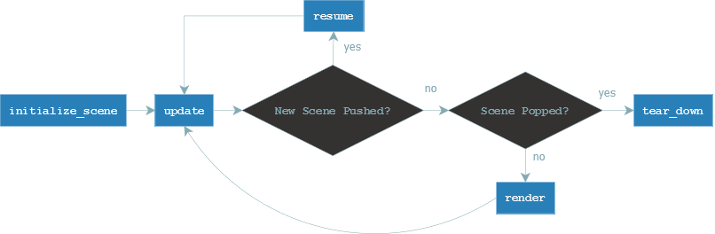

Inheriting the "Scene" class
============================
This section is describe how to inherit from the Scene class and how to use its methods.
For an example please scroll down to the end of this section.

Instancing the Scene class
--------------------------
After you've setup a game instance, you need some scenes to start your game.
The scene class gives you basic functionality to start with.
First of all you need to create a sub-class of Taz' Scene class and implement
all its abstract methods. The method names of these abstract methods
should already give you the idea of their purpose. Even if not, the explanation ffor each and every one of these
follows in this section.
However, when you create an object of your sub-scene you need to provide a unique identifier for
each scene you create. This identifier is used to find this particular scene in the game's registered scenes
as well as to push it on the scene's stack. In order to not break the code's functionality you need to call
the super constructor, if you intend to override the scene's __init__ method. Too see how this is done
see the following code-block of an example sub-class:

.. code-block:: python

    from taz import Game, Scene

    class MyScene(Scene):
        def __init__(self, identifier)
            super(MyScene, self).__init__(identifier)

        def initialize_scene(self):
            self.player = 0
            self.screen = 0
..

A Scene's life cycle
--------------------

What to put in "initialize"
~~~~~~~~~~~~~~~~~~~~~~~~~~~
This function is called whenever a scene is pushed on top of the game's scene stack
and should build up a certain scene. In here you might build up a level
or a main menu and its buttons. Everything that needs to be done when calling the scene
should be put in here.

.. code-block:: python

    from taz import Game, Scene

    class MyScene(Scene):
        def __init__(self, identifier)
            super(MyScene, self).__init__(identifier)
            self.player = 0
            self.screen = 0

        def initialize_scene(self):
            self.player = Player()
            self.screen = Screen()
            self.create_nice_map()
..

The scenes event cycle
~~~~~~~~~~~~~~~~~~~~~~
In the game's main-loop the scene, which is on top of the scene stack
is always the active one and its **update**- and **render**-methods are
called on each and every tick.
Why are there two functions when you call them right after another you ask?
You will get an answer n the followeng sub-sections.

Using the Update method
_______________________
The update method is responsible for updating (who would've thought of it) the game's
or scene's status. It always gets passed the update_context, which is set up on creation of
the game class.
This function should listen and respond to input events, calculate new positions of players,
basically doing most of the things that happen within a certain scene.

.. code-block:: python

    from taz import Game, Scene

    class MyScene(Scene):
        def __init__(self, identifier)
            super(MyScene, self).__init__(identifier)
            self.player = 0
            self.screen = 0

        def initialize_scene(self):
            self.player = Player()
            self.screen = Screen()
            self.create_nice_map()

        def update(self, update_context):
            key = self.capture_input()
            self.player.move_player(update_context["deltatime"], key)
..

Using the Render method
_______________________
The render method is the function to get your game to life. It is responsible for and just for drawing/printing everything to your screen.
It is NOT responsbile for any calculations, as this is update's job. It always gets passed the render_context, which is set up on creation of
the game class.

.. code-block:: python

    from taz import Game, Scene

    class MyScene(Scene):
        def __init__(self, identifier)
            super(MyScene, self).__init__(identifier)
            self.player = 0
            self.screen = 0

        def initialize_scene(self):
            self.player = Player()
            self.screen = Screen()
            self.create_nice_map()

        def update(self, update_context):
            key = self.capture_input()
            self.player.move_player(update_context["deltatime"], key)

        def render(self, render_context):
            self.screen.draw(self.player)
..

What to put in tear_down and resume
~~~~~~~~~~~~~~~~~~~~~~~~~~~~~~~~~~~
When leaving a scene there might still be some things to clean up before you can destroy the scene.
Everything you need to be cleaned up before popping a scene should be put inside the tear_down function.

In some cases you might want to store your current status of a level, e.g. when switching to an options menu.
When returning back to the game you most likely don't want to start over the level but instead keep on playing where you
left of. In fact Taz implementation allows you to push a scene on top another. When this top scene is then popped again
the scene following is re-activated and the new top scene. When this happens the resume-function of that scene below the popped one
is called, so you can put everything in here, which should get re-initiated.

.. code-block:: python

    from taz import Game, Scene

    class MyScene(Scene):
        def __init__(self, identifier)
            super(MyScene, self).__init__(identifier)
            self.player = 0
            self.screen = 0

        def initialize_scene(self):
            self.player = Player()
            self.screen = Screen()
            self.create_nice_map()

        def update(self, update_context):
            key = self.capture_input()
            self.player.move_player(update_context["deltatime"], key)

        def render(self, render_context):
            self.screen.draw(self.player)
..

Adding data to a single scene
-----------------------------
TODO