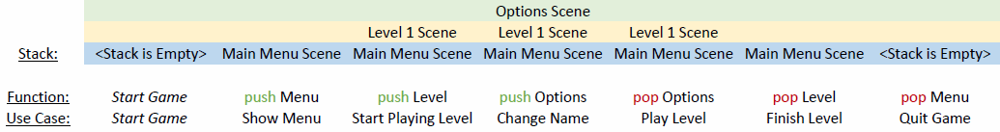

Introduction
============

This section is to inform about the purpose of Taz and some basic
concepts of game development.

What is a game loop?
--------------------
Let's assume you are playing on of the many shooters out there. On each frame
the game listens to your commands, like "move forward", "shoot", "jump". The game needs to capture these
inputs and respond accordingly in letting your character do the respective thing and draw this to your
screen. But even if you stand still the game keeps drawing the surroindings. There might be still movements
in your screen, like trees bending in the wind or rain falling from the sky. So the game asks
for information over and over again.
This "asking for information" is called the game loop. Somewhere in your code there
will be an pseudo-infinite loop which asks for these **updates** and **renders** them to your screen.
Of course the game doesn't run for an infinite time, so somehow you would have to manage
to tell the game-loop to stop at a certain point and exit the game, which why I called it **pseudo**-infinite.
Following an example of such a game loop.

.. code-block:: python

    def mainloop():
        delta_time = 0
        while True:
            start_time = current_time()

            level1.update(delta_time)
            level1.render()

            end_time = current_time()
            delta_time = end_time - start_time
..

This is a very common way to define such a main-loop. In this example the time between each iteration is calculated
and passed to the update-function.
Why you should do that can be read here: https://www.scirra.com/tutorials/67/delta-time-and-framerate-independenc
What exactly you put in the **update**- and **render**-function will be explained
in the followeing pages. For now it is enough, that you understand the basic functionality about it.

What is a scene stack?
----------------------
In the above code-block the game-loop always calls the **update**- and **render**-function of an object called
level1, which most likely represents the first map of a game. But what if you want to have multiple maps or
a title scene, with an awesome intro. You would only be able to show these when they are called from within your level1.
But then level1 would not be responsible for just the first map, but also a lot of other things.
To make sure you can show as much different levels and menus you want, we would have to alter the code-block to something
like:

.. code-block:: python

    def mainloop():
        delta_time = 0
        while True:
            start_time = current_time()

            current_scene.update(delta_time)
            current_scene.render()

            end_time = current_time()
            delta_time = end_time - start_time
..

Basically, what we did is getting rid off the definite call of the "level1"'s functions and rather tell the game
to update and draw whatever scene you want the game to currently draw.
As for now we introduced the term "scene". But what is a scene exactly?
Well, a scene is pretty much everything you can think of. It can be a title scene, where the mentioned intro is playing.
It could also be the main menu, any level of your game or even the options menu.
In each and every scene there are different functionalities, which must be coded and different inputs to be captured.
In the title scene you might only allow "Press Esc to skip", whereas in the menu you probably wan't some buttons capturing
clicks or you want your character to interact with objects in your level.

The problem however is to tell the game, which scene specifically to render. You would have to change the *current_scene*,
when you want to switch the scenes and that is exactly what is done, when using a scene stack.
The scene stack represents the currently loaded scenes such as level and an options menu. To decide
which scene to **update** and **render** the game looks at the stack's top scene and calls its **update** and **render**
function. This way the top pushed scene is always the active scene. When a scene is no longer needed, let's say for example
when you close the options menu and want to get back to the level it gets popped from the stack and new top scene
is now active again.

With that in mind the code-block can be altered once more to the following:

.. code-block:: python

    def mainloop(self):
        delta_time = 0
        while True:
            start_time = current_time()

            self.get_top_scene_of_stack().update(delta_time)
            self.get_top_scene_of_stack().render()

            end_time = current_time()
            delta_time = end_time - start_time
..

What is Taz?
------------
Taz is a small library handling the switching of scenes and making sure your scenes get
updated and rendered on every tick.

The scenes will be organised in a game stack, which will automatically be updated for all scenes whenever a new scene is
registered with the Taz library. The user has the opportunity to force scene changes in pushing or
popping from the game’s stack. Whenever you pop the last stacked scene the game will come to an end.

How can Taz help me organizing my game code?
--------------------------------------------
Usually when starting from scratch you have to setup the backend of your game first, before you
can go and implement whatever features your game should have, which means you would have
to setup the game's main-loop and the scene-stack to get going.
With Taz you have the opportunity to import this backend, so you won't have to think about it.
All you can do is setting up your scenes and get going with the awesome features you have planned.
Taz provides you with the main-loop and makes sure your scenes are updated on each tick.
With the library there is a set of just a few functions you will to have worry about.
These functions include pushing to and popping from the stack as well as registering your
scene with the game and of course everything to get your scene going.
You will be provided with a scene base class and all you have to do is implement
some abstract methods, such as "initialize", "tear_down", "update", "render".
What these methods are for is shown on the next few pages to get you going with your
very own "Taz"-based game.
Need another reason: Taz is working independent of any python based library, so whatever
you are using, be it PyGame, PyOgre, PyOpenGL, Taz will be ready for use after
setting up a few things.